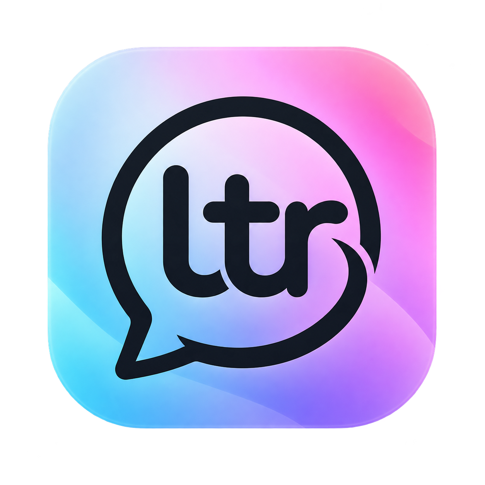

# LTR Chat

<p align="center">
  
</p>

<h1 align="center">LTR Chat</h1>

<p align="center">
  A modern, premium messaging web application built with HTML, CSS, Vanilla JavaScript, and Firebase.
</p>

A modern, premium messaging web application built with HTML, CSS, Vanilla JavaScript, and Firebase.

**LTR Chat** is an original product identity. It is not a clone of WhatsApp or Telegram.

## Features (v1)

- Email + Google authentication with guided onboarding
- Unique usernames + public profiles with privacy controls
- 1:1 messaging (text, emoji, images, videos, files, voice)
- Reply, react, copy, delete-for-me, delete-for-everyone (24h window)
- Groups with owner/admin/member roles
- WebRTC audio & video calling
- Presence, typing indicators, read receipts
- Drafts, pinned/muted/archived chats, Saved Messages
- Light / Dark / System themes
- PWA-ready (installable, standalone)

## Tech Stack

| Layer        | Technology                          |
|--------------|-------------------------------------|
| Frontend     | HTML5, CSS3, Vanilla JS (ES modules)|
| Auth         | Firebase Authentication             |
| Database     | Cloud Firestore + Realtime Database |
| Storage      | Firebase Storage                    |
| Messaging    | Firebase Cloud Messaging (optional) |
| Calls        | WebRTC + Firebase signaling         |
| Hosting      | Firebase Hosting                    |

## Project Structure

```
nexus-chat/
├── public/                 # Static assets & PWA
│   ├── icons/
│   ├── images/
│   └── manifest.webmanifest
├── src/
│   ├── config/             # Firebase initialization
│   ├── core/               # App shell, router, state
│   ├── auth/               # Login, register, onboarding
│   ├── firebase/           # Firestore, Storage, RTDB, FCM helpers
│   ├── chat/               # Chat list, view, composer, messages
│   ├── groups/             # Group management
│   ├── calls/              # WebRTC + signaling
│   ├── profile/            # Profile view & edit
│   ├── settings/           # Privacy, security, appearance...
│   ├── people/             # Search, contacts
│   ├── notifications/      # In-app + push
│   ├── components/         # Reusable UI primitives
│   ├── utils/              # Helpers
│   └── styles/             # Design system
├── index.html
├── firestore.rules
├── storage.rules
├── firestore.indexes.json
├── firebase.json
└── README.md
```

## Setup

### 1. Firebase Project

1. Create a project at [Firebase Console](https://console.firebase.google.com/).
2. Enable **Authentication** → Email/Password + Google.
3. Create a **Cloud Firestore** database (production mode).
4. Create a **Realtime Database** (for presence & typing).
5. Enable **Storage**.
6. (Optional) Enable **Cloud Messaging**.
7. Register a Web App and copy the config object.

### 2. Configure the App

Open `src/config/firebase.js` and replace the placeholder with your Firebase web config:

```js
const firebaseConfig = {
  apiKey: "...",
  authDomain: "...",
  projectId: "...",
  storageBucket: "...",
  messagingSenderId: "...",
  appId: "...",
  databaseURL: "..."   // Realtime Database URL
};
```

### 3. Deploy Security Rules

```bash
firebase deploy --only firestore:rules,storage
```

### 4. Local Development

Serve the project with any static server (Firebase Hosting emulator recommended):

```bash
firebase emulators:start --only hosting,firestore,auth,database,storage
```

Or a simple Python server:

```bash
python -m http.server 5000
```

Open `http://localhost:5000`.

### 5. Production Deploy

```bash
firebase deploy
```

## Security Model (Summary)

- **Public profiles** live in `users/{uid}` (limited fields).
- **Private data** lives in `privateUsers/{uid}` and `userSettings/{uid}`.
- Conversation access is gated by membership documents.
- Message “delete for everyone” is enforced with server timestamps + Security Rules (≤ 24 h).
- Storage paths are authorization-aware; files are never world-readable by default.
- Username uniqueness is enforced via a dedicated `usernames` collection + transaction.

See `firestore.rules` and `storage.rules` for the full ruleset.

## Browser Support

Modern evergreen browsers (Chrome, Firefox, Safari, Edge).  
WebRTC and MediaRecorder require HTTPS (or localhost).

## License

Private / proprietary for this project.